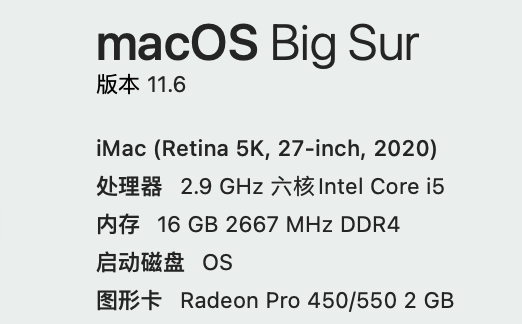
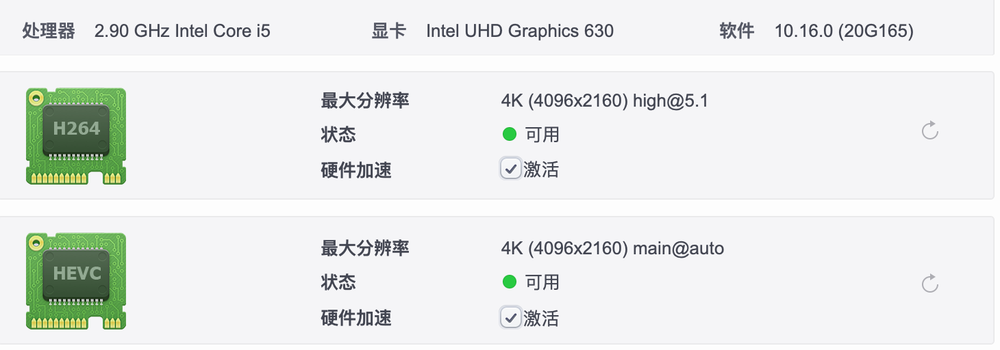

# Hackintosh-B460m-10400-rx560
A opencore efi file for hackintosh with msi b460 and 10400 

## Hardware

| CPU           | 10400                                                        |
| ------------- | ------------------------------------------------------------ |
| MotherBoard   | Msi-B460m                                                    |
| Memory        | Kinston Hack 8G * 2                                          |
| Wifi Card     | Fenvi [**FV-HB1200**](https://cn.fenvi.com/product_detail_28.html) |
| Graphics Card | Amd rx 560 2G                                                |
|               |                                                              |

## MotherBoard Configuration

#### Disable:

1. **Fast Boot ** 
2. **Msi Fast Boot**
3. **CSM**
4. **CFG Lock**
5. **Secure Boot**

#### Enable:

1. Multi-Display
2. Prime-Display : IGD
3. Above 4G decoding

# caution !!!!!

To enable **Airdrop** and **Hand-off**, **You need to config your own smbios code by opencore configurator**.

The Platform is **iMAC 20,1**.

## Perference

- [x] H264 \ HEVC decoding
- [x] Sleep
- [x] WIFI
- [x] Bluetooth
- [x] Lan   
- [x] Airdrop
- [x] Hand-off

